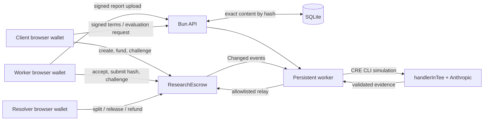

# Arbiter MVP technical documentation

Arbiter is a testnet escrow for a fixed research deliverable. A client commits
the work specification and funds a USDC deposit. A worker commits one Markdown
report. An evaluator proposes payment or refund from stored evidence; either
party can send the agreement to the named human resolver.

The contract is the authority for balances, parties, deadlines, and settlement.
The application stores the off-chain documents needed to interpret on-chain
hashes and runs the evaluation/relay process.

## Scope

The implemented task is a database-selection report: compare PostgreSQL,
MongoDB, and SQLite using supplied notes, explain tradeoffs, and recommend one
for a transactional SaaS workload. The creator can edit the brief, supplied
sources, acceptance criteria, amount, parties, and deadline within the
validated limits.

This is an unaudited **testnet MVP**. It deliberately excludes revisions,
fees, bonds, private document storage, arbitrary web research, citation
verification, evaluator marketplaces, and live TEE attestation.

The worker can paste Markdown or select a UTF-8 Markdown/text file; the exact
decoded content is saved and committed before on-chain submission.

## System map



The current execution mode is **CRE CLI simulation with a trusted relay**. The
confidential handler contains the model call and output validation, but a
simulation result is not live TEE attestation.

## Agreement lifecycle

| State | Entered by | What can happen next |
| --- | --- | --- |
| `Created` | Client creates fixed terms | Worker accepts before submission deadline. |
| `Accepted` | Worker accepts | Client funds before submission deadline. |
| `Funded` | Client deposits exact USDC amount | Worker submits one non-zero content hash; after the deadline anyone can refund the client. |
| `Submitted` | Worker commits report hash | Evaluator posts one timely result; after evaluation expiry anyone escalates to human review. |
| `Review` | Evaluator posts pass or fail | Either party challenges before the challenge deadline; otherwise anyone settles. |
| `Disputed` | An inconclusive result, a challenge, or evaluation timeout | Resolver assigns the worker's share before resolution expiry; otherwise anyone executes the 50/50 timeout split. |
| `Settled` | Settlement, resolver decision, or timeout | Terminal state. |

`Pass` proposes the full deposit to the worker. `Fail` proposes the full
deposit to the client. `Inconclusive` never creates an automatic financial
outcome and immediately enters human review.

At a deadline, the deadline action is allowed and the prior action is closed:
for example, challenge is closed at the exact `challengeDeadline`, while
settlement is allowed then. A resolver timeout splits `amount / 2` to the
worker and returns the odd micro-USDC remainder to the client. This is an
explicit testnet-demo rule, not a fairness claim.

## On-chain escrow

[`contracts/src/ResearchEscrow.sol`](contracts/src/ResearchEscrow.sol) is a
non-upgradeable Solidity 0.8.28 contract using OpenZeppelin `SafeERC20` and
`ReentrancyGuard`.

### Fixed terms and limits

`create` commits the following before the worker accepts:

- client (the caller), worker, and resolver addresses;
- USDC amount, from 1 micro-USDC to 100 USDC (`100e6`);
- hashes of the brief, sources, and evaluator policy;
- submission deadline; and
- evaluation, challenge, and resolution durations.

The contract rejects zero addresses, overlapping roles, expired deadlines, and
durations over the configured limits. It expects standard six-decimal ERC-20
USDC accounting. `fund` verifies that the escrow's token balance increased by
exactly the agreed amount, which rejects fee-on-transfer tokens.

### Public methods

| Method | Caller | Effect |
| --- | --- | --- |
| `create(Terms)` | Client | Creates immutable terms. |
| `accept(id)` | Designated worker | Accepts terms. |
| `fund(id)` | Client | Transfers the exact approved USDC deposit. |
| `submit(id, contentHash)` | Worker | Commits the one report hash and starts evaluation time. |
| `postEvaluation(...)` | Designated evaluator relay | Posts one result bound to escrow address, chain ID, policy, submission, and evidence hash. |
| `challenge(id)` | Client or worker | Freezes automatic settlement and enters human review. |
| `settle(id)` | Anyone | Settles an unchallenged pass/fail after its review period. |
| `resolve(id, workerAmount)` | Designated resolver | Pays any valid split before resolver expiry. |
| `executeTimeout(id)` | Anyone | Handles missing submission, evaluator expiry, or resolver expiry. |

The contract emits `Changed(id, state, actor)` for lifecycle updates and
`Paid(id, workerAmount, clientAmount)` on final settlement. It is intentionally
permissionless to execute eligible settlement and timeout actions: recipients
and amounts are still fixed by the agreement state.

## Content, signatures, and APIs

[`server/store.ts`](server/store.ts) uses Bun SQLite. Content is keyed by
`keccak256` of its exact UTF-8 text, stored as bytes, and rehashed when read.
This preserves report line endings and BOM behavior. The same database stores
one-time authorization nonces, evaluator jobs, indexed lifecycle events, and
the event cursor.

Off-chain content remains necessary to understand the commitments. A hash
proves that retrieved content is unchanged, but it cannot restore a document
lost from SQLite. Keep the escrow-specific database when operating a relay.

### Signed write endpoints

| Endpoint | Purpose | Required signer |
| --- | --- | --- |
| `POST /api/nonce` | Issues a five-minute nonce for a wallet address. | Any valid address |
| `POST /api/terms` | Validates and persists canonical brief, sources, and policy JSON; returns their hashes. | Creator |
| `POST /api/agreements/:id/submission` | Persists a 1–80,000-byte report and returns its hash. | Funded agreement's worker |
| `POST /api/agreements/:id/evaluate` | Enqueues an evaluation job. | Client or worker after submission |

The signed message includes the application origin, chain ID, escrow address,
wallet, action, exact body hash, and nonce. The API verifies the EIP-191
signature, verifies the caller's current on-chain role where needed, and then
consumes the nonce. Replays, body substitutions, cross-origin requests, and
wrong-action signatures fail.

Read endpoints are `GET /api/config`, `GET /api/agreements`,
`GET /api/agreements/:id`, and `GET /api/content/:hash`. Agreement reads combine
authoritative contract state with locally available content, job status, and
indexed events. If local content is unavailable, the hash remains visible and
the content field is `null`.

## Evaluation and evidence

[`shared/evaluation.ts`](shared/evaluation.ts) pins the `research-v1` prompt,
schemas, model identifier, word range, headings, source IDs, and semantic
criteria into the policy JSON whose hash is committed on-chain.

Evaluation does not browse. It checks only the report and supplied source notes.

1. Deterministic checks enforce the agreed word range, Markdown headings, and
   `[SOURCE_ID]` references.
2. The confidential handler passes the brief, sources, criteria, and report to
   the explicitly selected Anthropic model.
3. The model must return one JSON record for every semantic criterion. A pass
   requires report excerpts; every excerpt must appear verbatim in the report.
4. Any invalid provider output, missing credential, malformed response,
   unverified excerpt, or uncertainty becomes `INCONCLUSIVE`.
5. `INCONCLUSIVE` takes precedence over failures; failures take precedence over
   pass. The result carries exact hashes for the inputs and the evidence itself
   is hashed before its on-chain relay.

[`cre/handler.ts`](cre/handler.ts) performs the Anthropic request inside
`handlerInTee`. It retries only transport errors, rate limits, and 5xx responses
up to three attempts. It does not log credentials or raw model responses.
[`server/evaluator.ts`](server/evaluator.ts) runs a bounded CRE CLI simulation,
expects exactly one `ARBITER_EVIDENCE` output line, and revalidates the evidence
before returning it to the worker.

The background worker in [`server/worker.ts`](server/worker.ts) persists
evidence before broadcasting. On recovery it reloads current contract data and
revalidates every commitment before relay. It indexes `Changed` events with a
two-block safety buffer on Arc, stores a block-hash cursor, and rescans after a
detected local reorganization. It may also send eligible settlement/timeout
transactions. Only the evaluator private key belongs on the backend; party and
resolver transactions are browser-wallet signatures.

## Web application

[`web/app.tsx`](web/app.tsx) provides three routes:

- `/` lists up to 50 recent agreements and shows their on-chain status;
- `/create` validates terms, collects an acknowledgement of the timeout rule,
  saves a local draft, signs/stores the off-chain terms, then creates the
  agreement on-chain;
- `/agreements/:id` shows terms, content, criterion evidence, deadlines,
  event timeline, transaction links, and actions available to the connected
  role.

The UI polls every three seconds, uses chain block time for displayed deadlines,
and retains an in-flight transaction hash in `localStorage` to recover after a
reload. It supports Anvil and Arc testnet. On Arc, transaction links point to
Arcscan; local transactions display their shortened hash.

## Local development

Requirements: Bun 1.3+, Foundry (`forge` and `anvil`), and a browser wallet.

```sh
bun install
bun run abi
anvil
```

In a second terminal:

```sh
bun run setup:local
bun run dev:local
```

Open `http://localhost:3000`. Local setup deploys `MockUSDC` and the escrow,
mints 1,000 mock USDC to Anvil account 0, and writes `.env.anvil`. Use the first
three standard Anvil accounts as client, worker, and resolver. The fourth is a
public local-only evaluator relay identity.

No local fake evaluator is configured. Without CRE CLI access and an Anthropic
key, a requested evaluation remains unavailable and eventually becomes human
review through the contract's evaluation timeout.

## Fly.io deployment

[`fly.toml`](fly.toml) and [`Dockerfile`](Dockerfile) deploy the Bun server as
one Fly machine in Singapore. The server listens on port 8080 and retains its
SQLite database on the encrypted `arbiter_data` volume at `/data`.

The checked-in Fly configuration deliberately sets `DISABLE_WORKER=1`. This
makes the public app safe to use for creating, accepting, funding, submitting,
viewing evidence, challenging, resolving, and directly settling agreements
without invoking Anthropic or using the evaluator relay key. An evaluation
request is recorded but is not automatically processed in this mode.

Deploy changes with:

```sh
flyctl deploy --app arbiter-escrow-daksh --config fly.toml --ha=false
```

The deployment never includes `.env.arc`, wallet keys, model credentials, or
local SQLite files because [`.dockerignore`](.dockerignore) excludes them. Do
not add evaluator or Anthropic credentials to the public configuration. If a
future paid relay is enabled, add those values as Fly secrets, run a single
worker against the existing database volume, and retain `APP_ORIGIN` as the
public Fly URL so signature authorization remains bound to the correct origin.

## Arc testnet and real simulation

Copy `.env.example` to an untracked environment file and supply:

```dotenv
CHAIN_ID=5042002
RPC_URL=https://rpc.testnet.arc.network
ESCROW_ADDRESS=                 # set after deployment
DEPLOYMENT_BLOCK=               # set after deployment
DB_PATH=arc.sqlite
EVALUATOR_PRIVATE_KEY=          # relay only
ANTHROPIC_API_KEY=
ANTHROPIC_MODEL=claude-sonnet-4-20250514
```

Deploy with a separately supplied deployer key and evaluator address:

```sh
bun run abi
bun --env-file=.env.arc scripts/deploy-arc.ts
```

The script deploys against Arc testnet chain ID `5042002` using USDC at
`0x3600000000000000000000000000000000000000`. Record its emitted escrow
address and deployment block in the environment file. Install and authenticate
the Chainlink CRE CLI before starting the app. For one explicit evaluation and
relay proof after a worker submission:

```sh
DISABLE_WORKER=1 bun --env-file=.env.arc index.ts
bun --env-file=.env.arc scripts/proof.ts <agreement-id>
```

Do not run a second relay worker against the same database. The server scopes a
database to one chain and escrow and rejects an accidental deployment change.

### No-credit CRE simulation

`cre workflow simulate` executes the workflow code locally. In the normal
workflow, that code calls Anthropic, so it may consume model credits even
though it is not a live deployment. To exercise CRE compilation, the
confidential handler, structured evidence, and log transport without sending a
model request or an on-chain transaction, run:

```sh
bun --env-file=.env.arc scripts/simulate.ts <submitted-agreement-id>
```

This command removes the model credential from the child process. It returns
an `INCONCLUSIVE` record labelled `cre-cli-simulation-no-model`; it does not
write SQLite evidence or relay a result. It is a development check, not proof
of an AI evaluation.

## Verification

```sh
bun run typecheck
bun run test
bun run test:contracts
bun run build
bun run build:cre
```

These checks cover:

- contract authorization, state sequencing, deadline boundaries, duplicate
  payouts, evaluation bindings, resolver timeouts, and deposited-fund
  conservation;
- signed API authorization, nonce replay prevention, exact byte hashes,
  immutable storage, job persistence, reorg recovery, and idempotent relay
  behavior;
- deterministic/semantic evaluation validation, malformed provider data,
  missing credentials, and prompt-injection fixtures; and
- confidential handler request pinning, bounded retries, and secret exclusion
  from public evidence.

For browser coverage, keep Anvil running, deploy a fresh local setup, then run:

```sh
bunx playwright install chromium
bun run test:browser
```

The browser suite exercises payment, refund, and resolved challenge paths on
desktop and mobile, plus wallet rejection and reload recovery. It uses the real
local escrow but an explicitly labelled synthetic evaluator fixture; it does
not call Anthropic or CRE.

## Operational limits and risks

- Live Arc deployment, authenticated CRE simulation, Anthropic execution, and
  live TEE attestation have not been demonstrated by this repository alone.
- The evaluator relay is trusted to post only validated results. The contract
  verifies the result bindings but cannot inspect off-chain evidence semantics.
- All stored material is public sample material. The external model provider
  receives the complete evaluation input.
- The resolver has broad authority to choose any split before its deadline.
- Backend availability affects indexing and automatic evaluation, but any user
  can call the contract's eligible settlement and timeout actions directly.
- `MockUSDC` exists only for Anvil tests. Never deploy it as Arc USDC.

For an end-user walkthrough and current commands, see [README.md](README.md).
